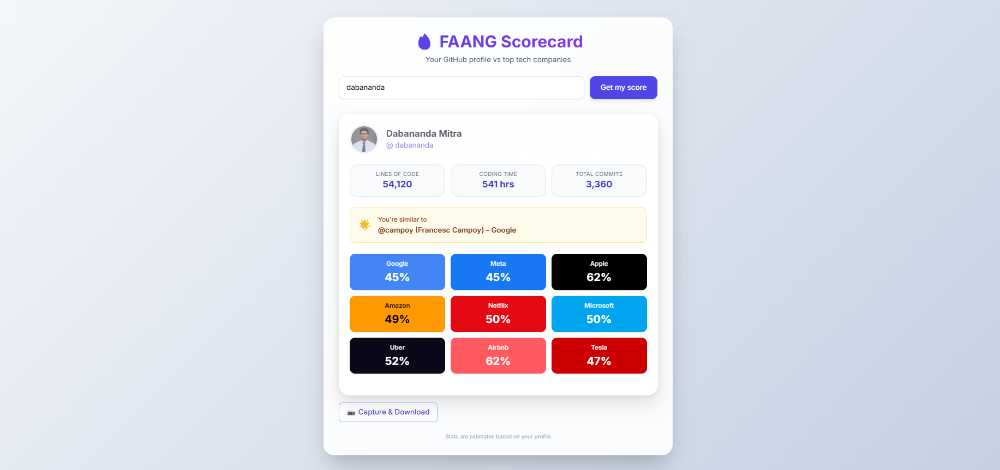

# 🔥 FAANG Scorecard

A fun, interactive web tool that analyzes your GitHub profile and calculates your "FAANG potential score" for top tech giants like Google, Meta, Apple, Amazon, Netflix, Microsoft, Uber, Airbnb, and Tesla!

#### Live at: [FAANG Scorecard](https://dabananda.github.io/faang-score/)



## ✨ Features

- **GitHub Data Analysis**: Fetches your public data (repos, followers, bio, location, account age).
- **Company Scores**: Calculates a weighted score (0-100%) for each major tech company based on unique criteria (e.g., Google values open source contributions heavily, while Apple values polished profiles).
- **Fun Estimates**: Generates playful estimates for "Total Lines of Code", "Coding Time", and "Total Commits" based on your activity.
- **Celebrity Match**: Finds which famous FAANG developer you represent based on a deterministic hash of your username.
- **Shareable Scorecard**: Generates a beautiful, downloadable image of your scorecard using `html2canvas`.
- **Social Sharing**: Easily share your results on Twitter, LinkedIn, Facebook, or Instagram (via clipboard/download).
- **Responsive Design**: Built with Tailwind CSS for a sleek, mobile-friendly experience.

## 🚀 How to Run

1.  **Clone the repository**:

    ```bash
    git clone https://github.com/dabananda/faang-score.git
    cd faang-score
    ```

2.  **Open `index.html`** directly in your browser.
    - Or use a simple local server (e.g., Live Server, `python -m http.server`).

## 🛠️ Tech Stack

- **HTML5**
- **Tailwind CSS** (via CDN)
- **JavaScript (Vanilla ES6+)**
- **[Canvas Confetti](https://www.npmjs.com/package/canvas-confetti)**
- **[html2canvas](https://html2canvas.hertzen.com/)**
- **GitHub REST API**

## 📝 License

This project is open source.

---

> **Note**: The scores and stats are for entertainment purposes only and are calculated based on public GitHub activity heuristics. They do not reflect actual hiring criteria! 😉
